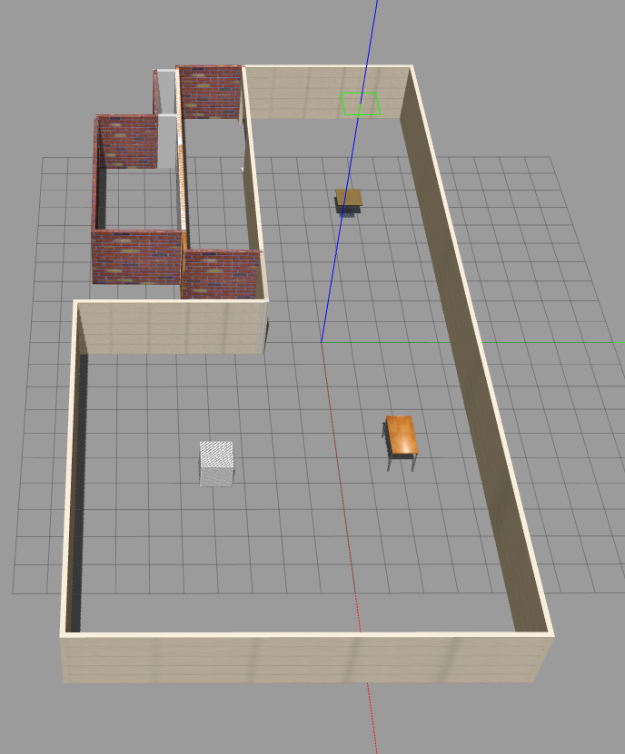
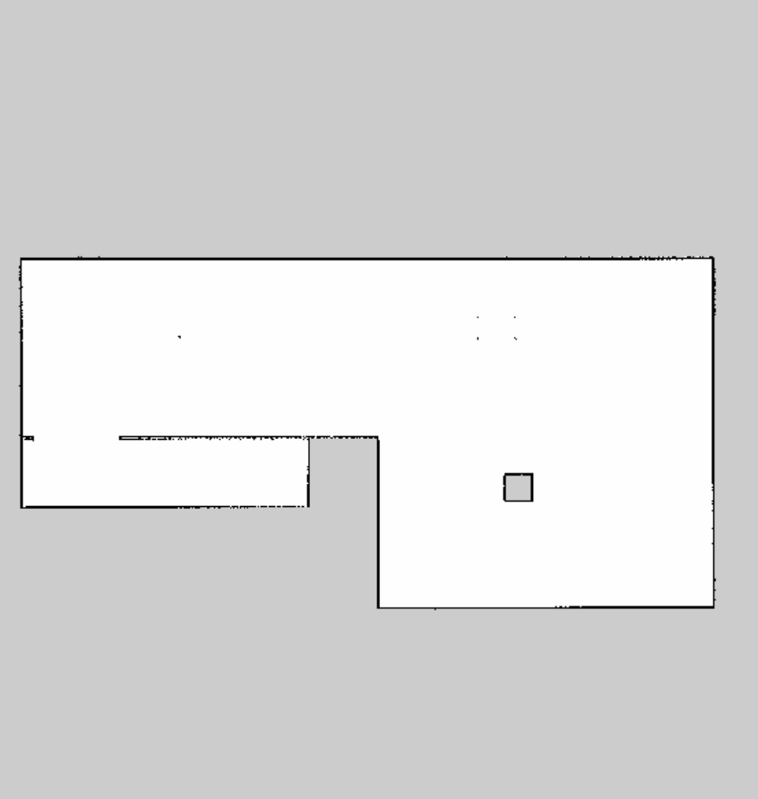

# Wheeled Robot Mapping using Gmapping

## Goal
- Use the `teleop_twist_keyboard` node to move the robot and utilize the `gmapping` package to create a map with the occupancy grid mapping algorithm.
- Create a single launch file for the project and include the `gmapping` launch file.

## Project Structure


## Packages Used
- `teleop_twist_keyboard`
- `gmapping`
- `myrobot` package from the previous project: [WHERE_AM_I](https://github.com/A-T-ELgammal/WHERE_AM_I)

## Run the Project
1. Source the workspace:
    ```bash
    source devel/setup.bash
    ```

2. Launch the project:
    ```bash
    roslaunch my_robot gmapping.launch
    ```

3. In another terminal, run the `teleop_twist_keyboard` node:
    ```bash
    rosrun teleop_twist_keyboard teleop_twist_keyboard.py
    ```

4. For save the output map, run the `teleop_twist_keyboard` node in another terminal:
    ```bash
    rosrun map_server map_saver -f <map_name> 
   ```
    that will generate the map.pgm and map,yaml files for the output map in the location refered in the terminal.

## Output Screenshots

- **Gazebo World Output:**
  

- **Map Output in RViz:**
  

Good luck exploring what's happening in your mapping project!
